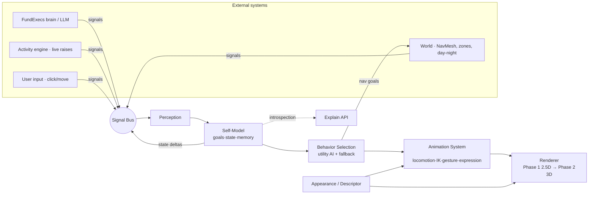
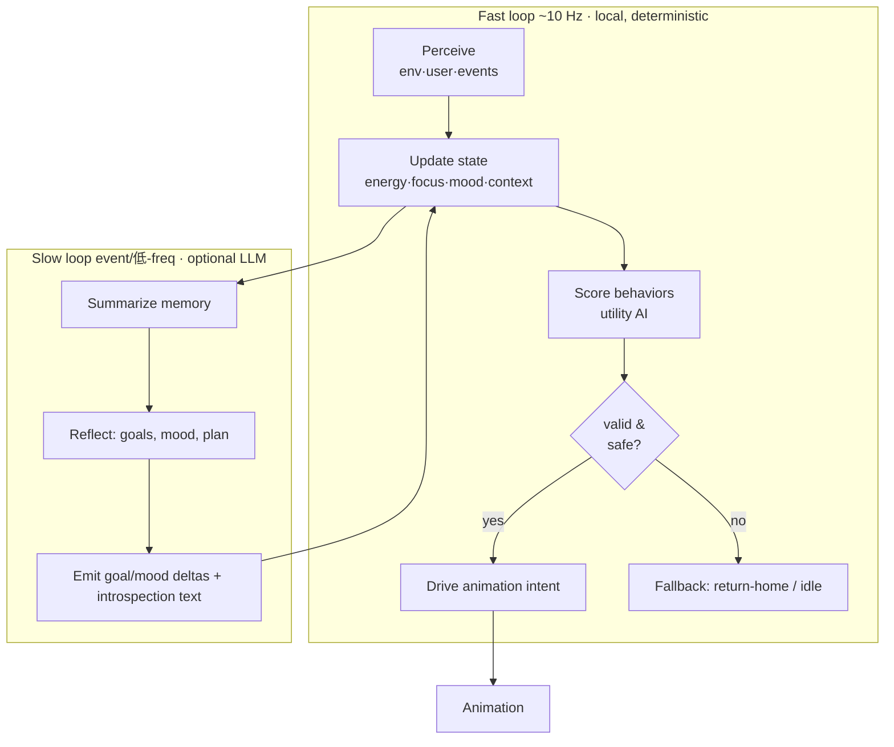

# FundExecs OS — Next‑Generation Avatar System

**Codename:** `LIVING‑EXECS`
**Scope:** avatar appearance, animation, customization, and a lightweight agentic self‑model for the FundExecs virtual office.
**Companion doc:** [`office-unity-world.md`](../office-unity-world.md) defines the *world* (map, rooms, props, lighting, NavMesh) and explicitly excludes characters. **This document defines the characters that inhabit it.**
**World unit:** `1 uu = 1 m` (matches the world spec). **Design pillars:** *believable bodies · natural motion · legible intent.*
**Status:** specification — ready for implementation by artists, animators, and engineers.

---

## 0 · Design references & pillars

| Reference | What we borrow |
|-----------|----------------|
| **The Sims** | Readable body archetypes, deep modular customization (clothing layers, morphs, palettes), autonomous "needs/moods" that drive idle life. |
| **Boston Dynamics *Spot*** | Grounded, physically‑plausible locomotion — weight shift, foot placement, balance recovery, no foot‑slide. |
| **WorkAdventure** | Social/isometric interaction grammar — proximity presence, "bubbles," lightweight status, spatial etiquette. |
| **Sarsi‑style agents / agentic knowledge systems / FundExecs brain** | A compact sense→think→act loop with internal state, short‑term memory, introspection, and safe fallbacks. |

**Three pillars, in priority order**

1. **Believable bodies** — proportions, silhouettes, materials, and expressions read as *people* (or the on‑brand coin mascot), not chips.
2. **Natural motion** — locomotion, idle life, micro‑animation and gesture blend procedurally; nothing snaps.
3. **Legible intent** — every avatar can *say what it is doing and why*. Self‑awareness is a first‑class, shippable feature, not decoration.

Everything below is organized so these four concerns — **appearance · animation · behavior · self‑model** — stay *independently ownable and independently swappable.*

---

## 1 · System architecture

The system is four decoupled modules over a shared **Avatar Descriptor** and an event **Signal Bus**. No module reaches into another's internals; they communicate through typed state + events. This is what lets the same *brain* drive a 2.5D sprite today and a 3D rig tomorrow (see §4 phasing).



| Module | Owns | Never touches | Primary owner |
|--------|------|---------------|---------------|
| **Appearance** | descriptor, meshes/sprites, materials, morphs, layer resolution | behavior logic | Artists |
| **Animation** | rig, clip graph, blending, IK, procedural motion, expressions | goal reasoning | Animators / gameplay eng |
| **Behavior** | perception, utility selection, fallbacks, nav requests | pixels, materials | Gameplay / AI eng |
| **Self‑Model** | internal state, memory, introspection, LLM slow‑loop | rendering | AI eng |

**Contract between modules** — Behavior emits **AnimationIntents** (`{verb, target, params, urgency}`); Animation emits **AnimationEvents** (`footstep`, `clipEnded`, `reached`, `gestureDone`); Self‑Model emits **StateDeltas** (`{key, value, cause}`). All three flow on the bus and are the *only* cross‑module coupling.

---

## 2 · Visual realism

### 2.1 Art direction

- **Style target:** stylized‑realistic ("elevated Sims"), not photoreal. Believable proportions and materials, softened surface detail, warm institutional palette consistent with the office (`docs/VISUAL_SYSTEM.md`).
- **Silhouette first:** every persona must be identifiable from its silhouette + primary garment color at 32 px. The 15 FundExecs personas keep their signature palettes and props (e.g. Rainmaker's money‑bag, Office Manager's clipboard; the **Earn** coin mascot remains a first‑class non‑human archetype).
- **Two body archetypes:** `human` (rigged biped) and `mascot` (the coin — a simplified rig with the same behavior surface). The descriptor's `archetype` field selects the pipeline; **the brain is archetype‑agnostic.**

### 2.2 Body model

| Attribute | Spec |
|-----------|------|
| Reference height | `1.55–1.95 m`, default `1.75 m`; mascot `1.2 m` sphere + limbs |
| Proportion system | 7.0–7.5 heads, stylized; parameterized by morph sliders (§3.2) |
| Build morphs | `shoulders, chest, waist, hips, limbLength, muscle, softness` ∈ [−1,1] |
| Skeleton (Phase 2) | Humanoid rig, ~55 bones (spine ×4, neck, head, clavicle/arm/hand ×2, leg/foot ×2, 15 finger bones optional), Mixamo/VRM‑compatible naming |
| Face | 52 ARKit‑style blendshapes (subset of 20 required); eye + head look‑at bones |
| LOD | LOD0 full rig+face; LOD1 no fingers/face micro; LOD2 billboard/imposter |

### 2.3 Materials, lighting, environmental reactions

- **Materials:** PBR in Phase 2 (`baseColor, roughness, metallic, normal`), tagged by semantic type (`skin, wool_matte, cotton, leather, metal, glass, coin_gold`). Phase 1 approximates with layered tints + a shared soft‑shadow/rim filter.
- **Lighting:** avatars sample the world's day/night rig and zone accent lights; a per‑avatar rim term keeps them readable against dark floors.
- **Environmental reactions (subtle, always restrained):** squint/lean toward the video wall when near it; warm tint under the LED cove; shadow direction follows the room key light; ground contact shadow scales with proximity to camera. These are **cosmetic reactions**, driven by Perception but rendered by Appearance — no behavior cost.

### 2.4 Phased rendering (the hybrid roadmap)

| Phase | Renderer | Body | Animation | Ships on |
|-------|----------|------|-----------|----------|
| **Phase 0 (today)** | SVG oblique 2.5D | walk atlas, 4‑dir × 3‑frame | distance‑based framing, corridor nav, seated states, conversations | `public/office/map.html` |
| **Phase 1** | 2.5D **skeletal** (2D bone rig over the atlas art, or layered puppet) | modular 2D parts | procedural blend, 2‑bone IK (arm/leg), look‑at, gesture layer | web (Canvas/WebGL2), current office |
| **Phase 2** | **3D** (Three.js / WebGL2, glTF + VRM) | full humanoid rig + blendshapes | full IK (foot/hand/look), animation graph, morph‑target expressions | web + native (shared core) |

The **core (descriptor + brain + behavior)** is renderer‑agnostic and identical across phases. Migration = swap the Animation/Renderer adapters; Appearance descriptor extends (adds `rig`, `blendshapes`) without breaking Phase‑1 fields.

---

## 3 · Animation system

### 3.1 Locomotion state machine

```
        ┌──────── arrive ────────┐
IDLE ──move──> ACCEL ──> WALK ──> DECEL ──> IDLE
  │                       │
  │                       └── obstacle/turn ──> TURN (blend facing)
  └── low energy ──> SIT/WORK ──> STAND ──> IDLE
```

- **Gaits:** `stroll (1.0 m/s)`, `walk (1.4)`, `brisk (1.8)`; chosen by `urgency` from behavior. Speed drives cadence; **cadence drives foot cycle by distance travelled** (no foot‑slide — carried over from Phase 0's stride model).
- **Turning:** facing is a continuous heading, eased toward velocity; sprite/rig quantizes only for display. Hysteresis prevents corner flicker.

### 3.2 Procedural blending & IK

- **Blend tree:** `locomotion (1D speed)` × `upperBody additive (gesture)` × `look‑at override` × `facial (expression)`. Layers composited every frame.
- **IK targets (Phase 2, approximated in Phase 1):**
  - **Foot IK** — plant feet on floor height, align to slope, prevent skate; balance recovery pose on stop (the "Spot" grounding).
  - **Look‑at IK** — head + eyes track a `focusTarget` (user cursor, speaker, video wall) with damped weight and comfort limits.
  - **Hand IK** — reach for anchors (desk, coffee, clipboard, handshake) via 2‑bone solver + hint pole.
- **Blend rules:** all transitions time‑ or distance‑normalized; additive gestures never fully override locomotion; IK weights ramp (no pops). Root motion off; motion is code‑driven so the brain owns position.

### 3.3 Idle life, micro‑animation, gesture

| Layer | Examples | Trigger |
|-------|----------|---------|
| Breathing | chest/shoulder bob (~0.2 Hz) | always (scaled by energy) |
| Idle micro | weight shift, glance around, check watch/phone, adjust cuff | idle timers, low focus |
| Seated work | typing lean‑in, document review, lean‑back think | seated behavior states |
| Gesture (additive) | nod, point, shrug, count‑on‑fingers, "present" toward a screen | conversation / event reactions |
| Reaction | brief celebrate (raise funded), concern (raise stalled), greet wave | Signal Bus events |

All amplitudes tuned **restrained / institutional**; `prefers-reduced-motion` collapses idle + gesture layers to static poses.

### 3.4 Expression system

- Phase 2: blendshape emotion set — `neutral, focused, pleased, concerned, surprised, tired` — blended from **mood + event**, capped so faces stay professional.
- Phase 1: eyebrow/mouth swaps on the 2D puppet; or a small overlay expression sprite.
- Expression is a *read‑out of internal state* (mood/energy/confidence), closing the loop between the brain and the face.

---

## 4 · Customization framework

### 4.1 Modular layers

Slots resolve in a fixed paint order; each slot takes an `item` id + `palette` + optional `anchor`:

```
skin → underlayer → base (suit/dress/shirt+trousers) → outerwear (blazer/coat)
 → footwear → headwear → face-acc (glasses) → hand/held (clipboard, coin, cup, bag)
 → badge/lanyard → fx (status ring)
```

- Items are authored per archetype; **mascot** ignores human‑only slots.
- Conflicts resolved by slot priority; hidden‑surface removal for layered garments (Phase 2).

### 4.2 Morph targets

- **Body morphs** (§2.2) and **face morphs** (identity: nose, jaw, eyes, cheeks) are normalized sliders stored in the descriptor. Phase 1 approximates body morphs via part‑scale + swap; face via preset heads.
- Deterministic: the same descriptor → the same avatar on every client.

### 4.3 Color & material palettes

- Named palette tokens (`primary, secondary, accent, trim`) map to material params. Persona defaults preserve brand identity; users may recolor within a curated, accessible palette (contrast‑checked against floor/wall).

### 4.4 Avatar Descriptor — appearance profile

Compact, versioned, JSON. Appearance + behavior travel together (behavior in §6.7). Example:

```json
{
  "schema": "fundexecs.avatar/1.0",
  "id": "rainmaker",
  "identity": { "role": "Rainmaker", "displayName": "Rainmaker", "pronouns": "they/them" },
  "appearance": {
    "archetype": "human",
    "body": { "height": 1.82, "build": "mesomorph",
              "morphs": { "shoulders": 0.25, "waist": -0.1, "muscle": 0.2 } },
    "skin":  { "tone": "#c68b6a" },
    "hair":  { "style": "short_side", "color": "#2b1d14" },
    "face":  { "preset": "m_ovoid", "morphs": { "jaw": 0.1, "eyes": -0.05 } },
    "layers": [
      { "slot": "base",     "item": "suit_2pc",  "palette": { "primary": "#14532d", "secondary": "#0b3a20" } },
      { "slot": "footwear", "item": "oxford",    "palette": { "primary": "#241a12" } },
      { "slot": "held",     "item": "money_bag", "anchor": "hand_r" },
      { "slot": "fx",       "item": "status_ring" }
    ],
    "materials": { "base": "wool_matte", "held": "canvas" }
  }
}
```

Mascot example (`earn`): `archetype:"mascot"`, `base` item `coin_body` with `coin_gold` material, human garment slots omitted.

---

## 5 · Agentic self‑awareness

A **two‑loop brain**: a deterministic **fast loop** for real‑time behavior, and an optional **LLM slow loop** (the FundExecs brain / Claude) for reflection and natural‑language introspection. The avatar is fully functional with the slow loop **absent or offline** — the LLM only *enriches*.



### 5.1 Internal state model

```json
{
  "goals": [ { "id": "close_deals", "kind": "work", "priority": 0.9, "progress": 0.3 } ],
  "activeGoal": "close_deals",
  "activeBehavior": "observe_raise",
  "drives":   { "energy": 0.66, "focus": 0.58, "social": 0.4 },
  "affect":   { "mood": "confident", "confidence": 0.72, "valence": 0.5, "arousal": 0.4 },
  "context":  { "zone": "trading_floor", "nearby": ["capital-raiser"],
                "timeOfDay": "afternoon", "lastSignal": "raise.tick:NOVA" },
  "memory":   [ /* ring buffer, see 5.4 */ ]
}
```

- **Drives** decay/recover over time (energy drops while working, recovers on break; focus drops with interruptions).
- **Affect** is derived from drives + recent events; it feeds expression (§3.4) and voice.
- **Confidence** gates behavior commitment and colors introspection ("I think…" vs "I'm going to…").

### 5.2 Perception modules

| Module | Senses | Emits |
|--------|--------|-------|
| **Environment** | zone, walkability/NavMesh, nearby avatars & props, day/night | `context.zone`, `context.nearby`, `focusTarget` candidates |
| **User** | click‑select, click‑to‑move, hover, "talk" | `signal:user.select`, `user.move`, `user.attention` |
| **System** | activity engine (raise tick/funded/stalled), occupancy, external hooks | `signal:raise.*`, `room.occupancy`, `ext.*` |

Perception is **throttled and budgeted** (spatial hash for `nearby`, event‑driven for system signals) — no per‑frame world scans.

### 5.3 Behavior selection (utility AI) + safe fallback

Each candidate behavior exposes a `score(state) → [0,1]` from weighted considerations (goal alignment, drive satisfaction, context fit, social bias, cooldown). Highest score wins; ties broken by current‑behavior inertia (avoids dithering).

```
behaviors = [ Idle, GoTo(zone), WorkAtDesk, ObserveRaise, Converse(agent),
              Greet(agent), TakeBreak, ReactToEvent(evt) ]
pick = argmax(b.score(state)) filtered by b.precondition(state)
```

**Safe fallback logic (always available):**
1. If chosen behavior's **preconditions fail mid‑run** (nav path lost, target gone) → cancel cleanly.
2. If **no behavior scores > ε** → `Idle` at current spot.
3. If **nav fails repeatedly** → teleport‑free `ReturnHome` to the persona's `homeZone` anchor.
4. LLM slow‑loop outputs are **validated against the allowed behavior/goal set**; anything out‑of‑vocabulary is dropped and the fast loop continues. Timeouts → local behavior only. The brain **cannot** be driven into an invalid or unsafe state by an external signal or model output.

### 5.4 Short‑term memory & introspection loop

- **Memory:** fixed‑size ring buffer (default 16) of `{t, type, summary, salience}` events; salience‑weighted eviction. Cheap, bounded, client‑local.
- **Introspection loop:** on demand (user click) or low‑frequency tick, the brain composes an **intent explanation** from `activeGoal + activeBehavior + top memory + affect`. Works **without** the LLM via templates; the LLM slow loop produces richer phrasing when available.

### 5.5 Explainability / introspection response

Canonical structured form (renderer shows the `say` line; tools can read the rest):

```json
{
  "say": "Heading to the trading floor to watch NOVA CAPITAL — it just ticked up.",
  "intent": "observe_raise",
  "because": ["goal:close_deals(0.9)", "signal:raise.tick:NOVA", "nearby:capital-raiser"],
  "confidence": 0.72,
  "focus": "raises",
  "energy": 0.66,
  "mood": "confident",
  "next": "if Capital Raiser is free, sync for ~20s"
}
```

### 5.6 Behavior profile descriptor

Ships alongside appearance (§4.4); tunes the brain per persona:

```json
{
  "behavior": {
    "personality": { "extraversion": 0.7, "conscientiousness": 0.85, "openness": 0.6,
                     "agreeableness": 0.6, "stability": 0.7 },
    "baseline":    { "energy": 0.8, "focus": 0.6, "social": 0.7 },
    "goals":       [ { "id": "close_deals", "kind": "work", "priority": 0.9 },
                     { "id": "network",     "kind": "social", "priority": 0.6 } ],
    "homeZone": "trading_floor",
    "roamProfile": "client_facing",
    "socialBias": 0.7,
    "voice": { "tone": "assured", "verbosity": "concise" }
  }
}
```

---

## 6 · Integration & hooks

External systems steer avatars **only** through the bus API — never by reaching into state directly. Mirrors the existing `window.FundExecsActivity` surface.

```js
window.FundExecsAvatars = {
  setGoal(id, goal),          // upsert/replace a goal (validated against goal vocab)
  setContext(id, patch),      // merge context signals (zone, focusTarget, …)
  pushEvent(evt),             // broadcast a system signal (raise.funded, announce, …)
  setEnvironment(patch),      // day/night, occupancy, zone accents
  setDescriptor(id, desc),    // hot-swap appearance/behavior profile
  onIntrospect(id) -> Promise<Introspection>,  // ask an avatar to explain itself
  attachBrain(fn)             // register the optional LLM slow-loop provider
};
```

- **`attachBrain`** injects the FundExecs/Claude slow loop; absent → deterministic local brain. The provider receives a **redacted memory+state summary** and must return goal/mood deltas + `say` text; outputs are schema‑validated and rate‑limited.
- All inputs treated as **untrusted**: validated, clamped, and incapable of forcing unsafe behavior (§5.3).

---

## 7 · Example behaviors & interaction flows

### 7.1 Behavior catalog (starter set)

| Behavior | Precondition | Effect | Animation intent |
|----------|--------------|--------|------------------|
| `Idle` | always | breathe + micro‑idle | `idle` |
| `GoTo(zone)` | path exists | navigate corridor graph / NavMesh | `walk`, look‑ahead |
| `WorkAtDesk` | at desk, energy>0.2 | type/review cycle, energy↓ focus↑ | `sit`, `type`, `review` |
| `ObserveRaise` | raise active in zone | watch video wall, react to ticks | `walk`→`look_at(wall)`, `nod` |
| `Converse(a)` | `a` nearby & free | face, exchange, speech bubble | `talk`, additive `gesture` |
| `Greet(a)` | `a` enters proximity | brief wave/nod | additive `wave` |
| `TakeBreak` | energy<0.3 | go to lounge, recover | `walk`, `sit`, `lean_back` |
| `ReactToEvent(e)` | salient signal | celebrate/concern beat | additive reaction |

### 7.2 Flow — user clicks an avatar

```
user.select(rainmaker)
  → Perception: signal user.select
  → Self-Model: introspection loop composes response
  → onIntrospect resolves → UI shows `say` + state chips (focus/energy/mood)
  → Animation: look_at(user cursor), brief acknowledge nod
```

### 7.3 Flow — a raise gets funded (system event)

```
FundExecsAvatars.pushEvent({type:'raise.funded', company:'NOVA CAPITAL', zone:'trading_floor'})
  → Perception broadcasts to avatars in/near zone
  → Behavior: ReactToEvent scores high for client-facing personas
  → nearby avatars play restrained celebrate beat; Rainmaker's confidence +; memory records event
  → 2–3s later utility settles back to prior behavior (fallback to Idle/WorkAtDesk)
```

### 7.4 Flow — two roamers meet (emergent conversation)

```
proximity(rainmaker, capital-raiser) < CHAT_RANGE and both paused
  → Behavior: Converse mutual; face each other
  → Animation: talk + additive gestures; speech-dot bubbles
  → Self-Model: social drive satisfied; memory logs "synced with Capital Raiser"
  → timeout/one departs → Converse precondition fails → clean cancel → resume
```

### 7.5 Introspection examples

| Situation | `say` (local template) | `say` (LLM slow loop) |
|-----------|------------------------|------------------------|
| Walking to trading floor after a tick | "Going to check NOVA CAPITAL — it just moved." | "NOVA just ticked up, so I'm heading over to read the room before I ping Capital Raiser." |
| Seated, low energy | "Wrapping up this review; I'm running low, break soon." | "Finishing this diligence pass — focus is holding but energy's low, I'll take a short break after." |
| Idle, nothing salient | "Standing by — nothing pressing right now." | "Quiet moment; I'm holding at my desk until a raise moves or someone needs me." |

---

## 8 · Performance & platform

| Budget (mid‑tier laptop, 20 avatars) | Phase 1 (2.5D) | Phase 2 (3D) |
|--------------------------------------|----------------|--------------|
| Frame time for avatar system | ≤ 2 ms | ≤ 4 ms |
| Brain fast loop | ≤ 0.5 ms (10 Hz, amortized) | same |
| Draw | DOM/SVG or Canvas mutation, **no scene re‑render** | instanced skinned meshes + LOD |
| Memory / avatar | < 50 KB state; atlas shared | shared rig + morph deltas |

- **Fast loop is decoupled from render** (fixed ~10 Hz tick; render interpolates). Pauses on `visibilitychange`; honors `prefers-reduced-motion`.
- **Slow loop** is off the hot path: event‑driven, rate‑limited, cancellable; never blocks a frame.
- **Native**: Phase 2 core is portable (shared TS brain; renderer adapter for the Unity 2.5D world in `office-unity-world.md` or a native WebGL host).

---

## 9 · Implementation roadmap

| Milestone | Deliverable | Owners |
|-----------|-------------|--------|
| **M0 — Extract core** | Pull brain + descriptor out of `map.html` into a renderer‑agnostic module; keep Phase‑0 sprites as the first adapter. | Eng |
| **M1 — Self‑model v1** | Internal state, memory, utility selection, fallback; `onIntrospect` with templates; state chips on click. | AI eng |
| **M2 — 2.5D skeletal** | 2D bone rig + modular layers + 2‑bone IK + gesture layer over persona art. | Artists + animators |
| **M3 — Hooks + LLM slow loop** | `FundExecsAvatars` API; `attachBrain` to FundExecs/Claude; validation + rate limits. | AI eng |
| **M4 — 3D pipeline** | glTF/VRM rig, blendshapes, full IK, PBR; renderer adapter; LOD. | 3D artists + eng |
| **M5 — Polish** | Environmental reactions, expression tuning, native host, perf pass. | All |

**Definition of done per persona:** descriptor authored (appearance+behavior), silhouette‑legible at 32 px, locomotion/idle/seated/gesture verified, introspection returns a sensible `say` in ≥5 situations, reduced‑motion + perf budgets pass.

---

## 10 · Appendix

### 10.1 Signal taxonomy (starter)

`user.select · user.move · user.attention · raise.tick · raise.funded · raise.stalled · room.occupancy · env.daynight · announce · ext.*`

### 10.2 Glossary

- **Descriptor** — compact JSON defining one avatar's appearance + behavior profile.
- **Fast loop / slow loop** — deterministic real‑time brain vs optional LLM reflection.
- **Drive / Affect** — homeostatic needs (energy/focus/social) vs derived emotion (mood/confidence).
- **Animation intent** — a verb+params request from behavior to animation; the only coupling between them.
- **Archetype** — `human` (biped rig) or `mascot` (coin); same behavior surface.

### 10.3 Open questions for review

1. Confirm the LLM slow‑loop provider (FundExecs brain endpoint vs direct Claude API) and its latency/cost envelope.
2. Phase‑2 rig standard: **VRM** (avatar interop) vs plain glTF humanoid — affects customization tooling.
3. How much user‑facing customization to expose vs. locked persona identity.
4. Whether native delivery targets the Unity world (`office-unity-world.md`) or a shared WebGL host.
